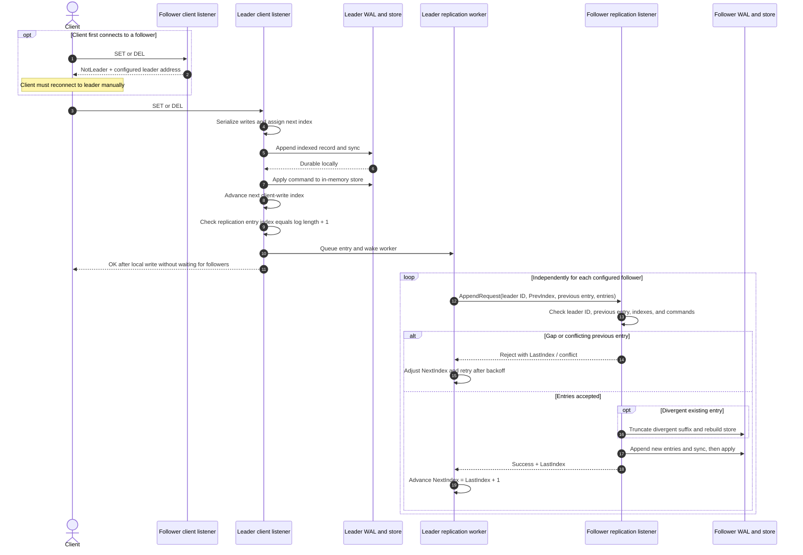

# Client request path

This shows a client `SET` or `DEL`. The client connects to a node's **client** TCP port; the leader's replication workers connect separately to each follower's **replication** TCP port.

`GET`, `LEN`, and `PING` use the connected node's client listener and do not enter the write replication path. A follower serves `GET` and `LEN` from its local store, so a read can lag behind a recently acknowledged leader write. The sample CLI prints the `NotLeader` address but does not automatically reconnect.
