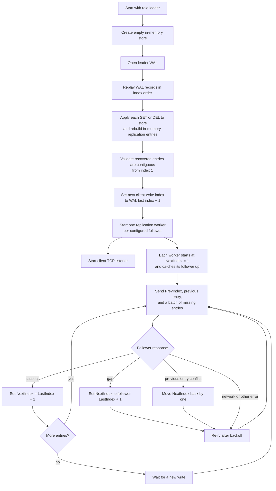
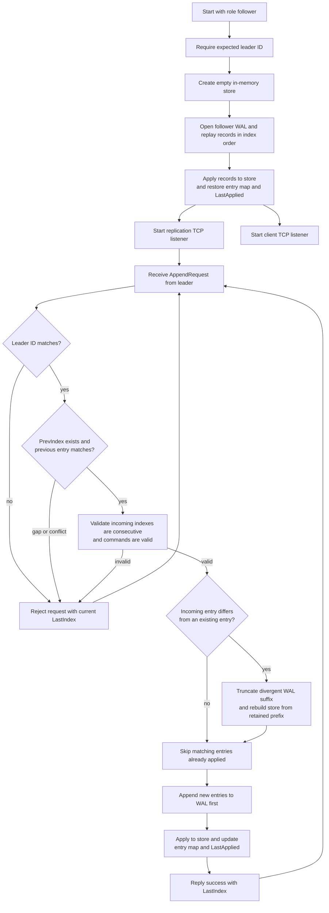

# Node startup and replication

The role is chosen by `-role` when `cmd/server/main.go` starts. The two paths share the same client protocol, but only the follower opens a separate replication listener. These diagrams show the current configured leader/follower behavior; startup does not elect a leader.

## Starting as leader

The leader checks that its recovered log is contiguous. Each worker then uses the follower's reported index to catch up; a conflicting previous entry makes it search backward for a shared prefix.

## Starting as follower

The follower's client listener serves local reads. It rejects SET and DEL with `StatusNotLeader` and the configured leader address. It does not forward the request itself.
